# Unity Learning Record

##  目录

- [Unity Learning Record](#head1)
  - [ 目录](#head2)
  - [ 简介](#head3)
  - [ 技术能力](#head4)
  - [ Demos](#head5)
    - [ 2DSkipGame](#head6)
    - [ PokemonUI](#head7)
    - [ SimpleBag](#head8)
    - [ SimpleTalk](#head9)
    - [ CricketMaster](#head10)
    - [ 随机地图生成](#head11)
    - [ Excel转SO工具](#head12)
    - [ 多武器系统](#head13)
    - [ 多枪械射击Demo](#head14)
    - [ 俯视角多人RPG](#head15)
    - [ 分手厨房](#head16)
    - [ 宝藏猎人](#head17)

##  简介

​		个人Unity学习记录,记录自2022年春开始的游戏开发历程。为进一步学习，工作做准备。

仅记录完成度较高的demo。部分demo存储在Github个人仓库中，可供参考。

##  技术能力

| 技术内容                       | 掌握程度     |                                 |
| ------------------------------ | ------------ | ------------------------------- |
| 2D物理系统                     | 掌握         | :star::star::star::star:        |
| **3D物理系统**                 | **熟练**     | :star::star::star:              |
| **UGUI**                       | **熟练**     | :star::star::star:              |
| **2D动画系统**                 | **掌握**     | :star::star::star::star:        |
| **UinTask异步框架**            | **较深理解** | :star: :star::star::star::star: |
| **JobSystem**                  | **较为熟练** | :star::star::star:              |
| **ShaderGraph**                | **基本了解** | :star::star:                    |
| **Mirror && NetCode 网络框架** | **基本了解** | :star::star:                    |
| **音效系统**                   | **了解**     | :star:                          |
| **常见设计模式 以及 代码架构** | **较为熟练** | :star::star::star:              |
| **粒子系统**                   | **基本了解** | :star::star:                    |
| **Unity常用性能分析工具**      | **基本了解** | :star::star:                    |
| **Unity性能优化**              | **了解**     | :star:                          |
| **Unity DOTS**                 | **基本了解** | :star::star:                    |
| **C#语言基础**                 | **较深理解** | :star::star::star::star::star:  |
| **Unity 灯光**                 | **了解**     | :star:                          |
| **Unity 特效**                 | **了解**     | :star:                          |
|                                |              |                                 |
|                                |              |                                 |
|                                |              |                                 |

##  Demos

###  2DSkipGame

`2D平台跳跃小游戏,参考蔚蓝实现了一套手感优秀的跳跃系统`

| **Physics**  | 使用射线检测,而非默认刚体,替代物理操作 |
| ------------ | -------------------------------------- |
| **跳跃补偿** | **与边角交互时会给予跳跃补偿**         |
| **粒子特效** | **跳跃,移动粒子特效**                  |

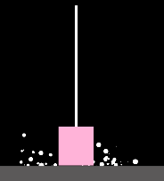

###  PokemonUI

`宝可梦UI+Json数据存储`+`MVC设计模式`

| **UGUI模型渲染** | 使用RawImage+Render Texture在UI上显示3D模型 |
| ---------------- | ------------------------------------------- |
| **MVC设计模式**  | **UI显示和数据分离**                        |

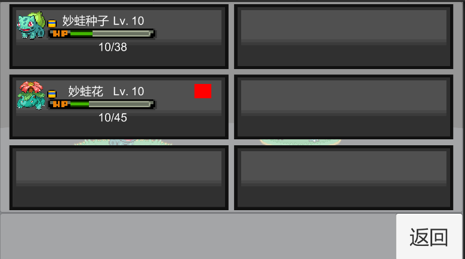

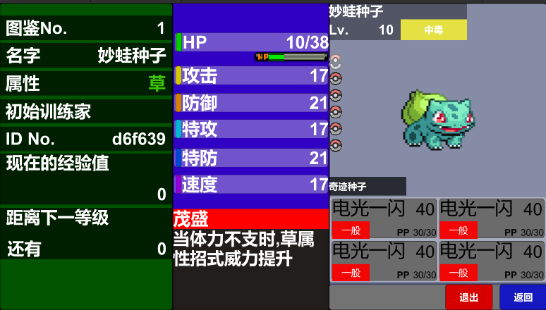

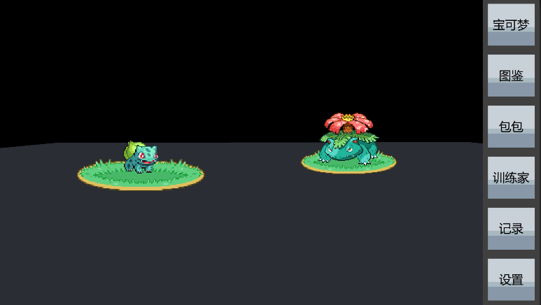

###  SimpleBag

`简单的背包系统`

技术细节

| Json数据管理      | Diy的Json数据管理背包数据的持久化      |
| ----------------- | -------------------------------------- |
| **Unity物理系统** | **OmTiggerXXX实现道具拾取**            |
| **UGUI事件**      | **OnPointerXXX实现鼠标交互细节**       |
| **UGUI布局**      | **使用UGUI的栅格组件完成背包格的摆放** |

| 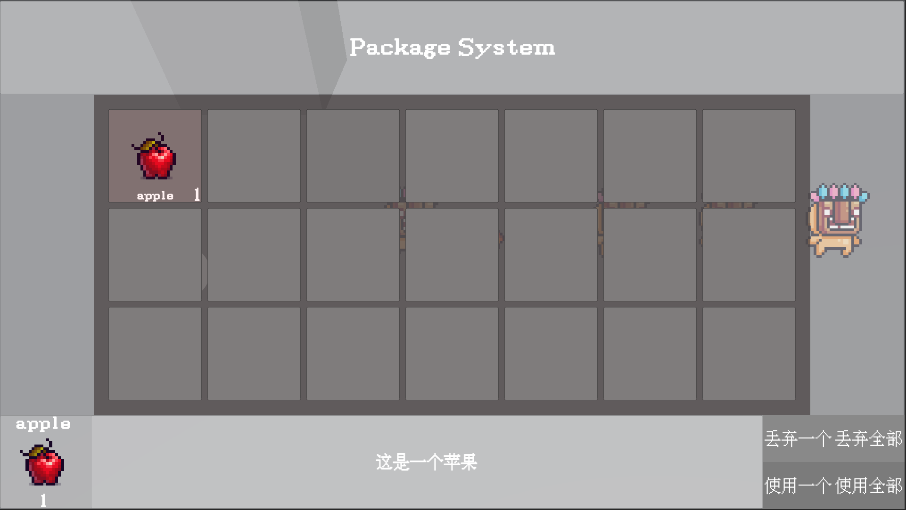 |      |
| -------------------------- | ---- |
|                            |      |

###  SimpleTalk

`一套简单的对话系统,分离了数据和逻辑`

技术细节

| Json数据管理      | **使用Diy的JsonManager实现对话数据的存储** |
| ----------------- | ------------------------------------------ |
| **Unity物理系统** | **使用OnTiggerXXX实现基本交互**            |

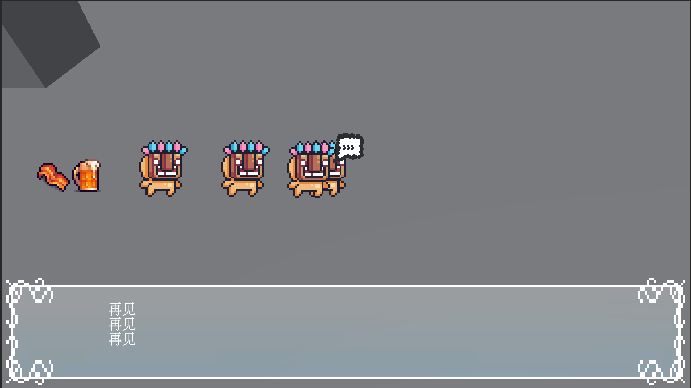

###  CricketMaster

`2D平台跳跃+2.5D回合制战斗`

技术细节

| UniTask          | 使用Unity特化的异步框架完成战斗逻辑               |
| ---------------- | ------------------------------------------------- |
| **UITookit**     | **使用UITookit进行编辑器拓展,实现快捷添加数据**   |
| **反射**         | **使用反射在编辑器模式下动态数据**                |
| **技能效果组合** | **组合设计模式实现的技能,一个技能由多个效果组成** |
| **2.5D场景**     | **一个统一的场景管理器,实现2.5D的视觉效果**       |

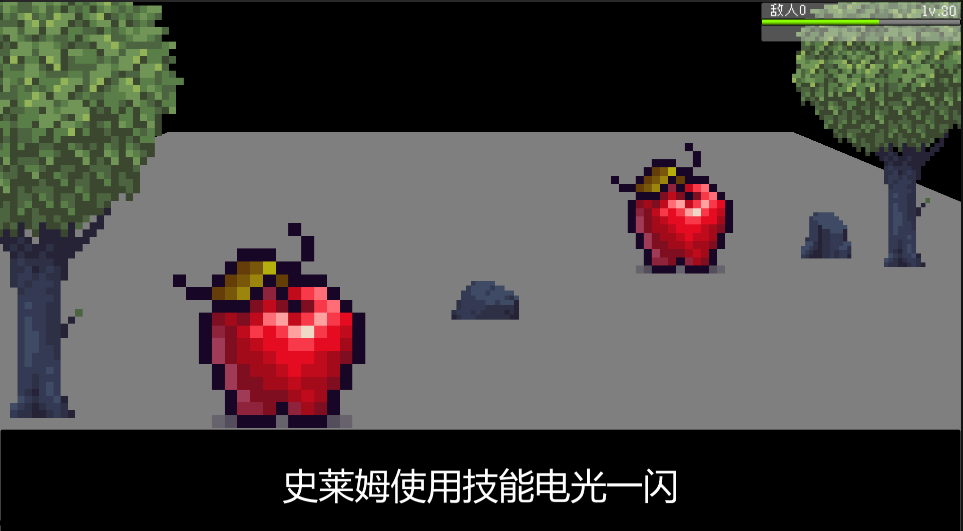

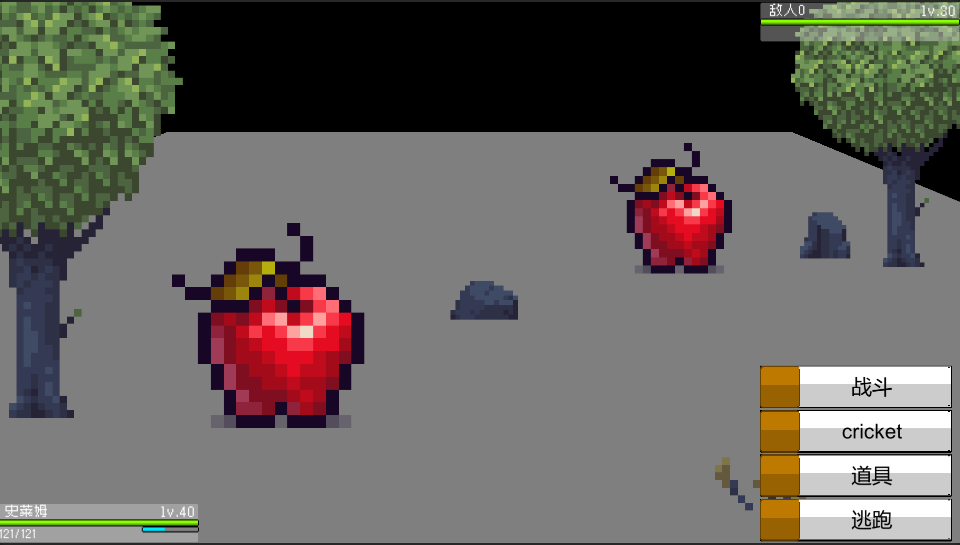

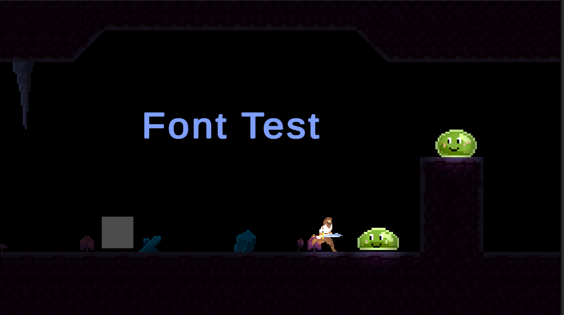

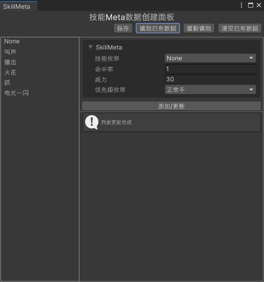

###  随机地图生成

`随机地图数据的生成`

DIY了一套随机地图生成算法,可用于俯视角地牢游戏,类饥荒2.5D游戏的地图生成

技术细节

| KMeans聚类     | 对生成的地图进行区域,地块划分          |
| -------------- | -------------------------------------- |
| **噪声图**     | **使用柏林噪声实现基础地图生成**       |
| **元胞自动机** | **地图平滑**                           |
| **并行加速**   | **使用并行算法加速地图生成的计算速度** |

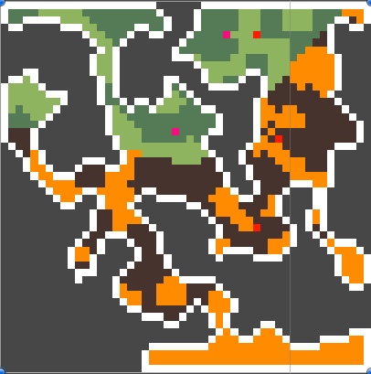

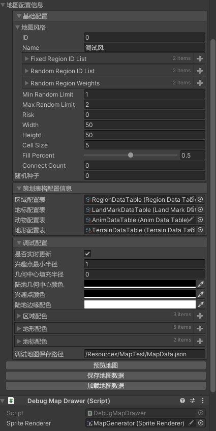

###  Excel转SO工具

`一个简单的自动工具,可根据Excel表格的信息自动生成C#代码,并且将数据读取到So中便于后续使用`

技术细节

| C# IO操作            | 生成模板代码文件需要进行IO读写          |
| -------------------- | --------------------------------------- |
| **C# Excel第三方库** | **读取Excel数据需要第三方库完成**       |
| **So**               | **根据Excel数据自动生成对应数据容器So** |
| **反射**             | **根据数据动态创建对象的实例**          |

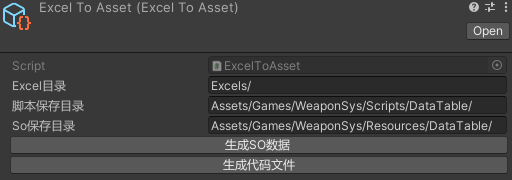

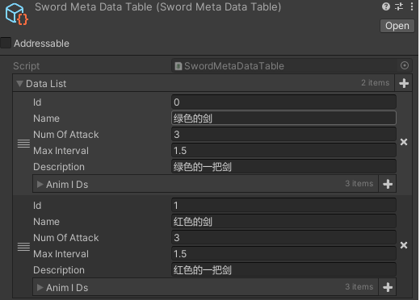

###  多武器系统

`便捷的多武器系统`

类似死亡细胞的攻击系统,通过 `Excel转SO工具` 读表来实现武器数据和逻辑的分离,只切换武器ID即可完成不同武器的切换

核心技术在于借鉴了 `ECS` 的组件设计思想,将玩家拆分成多个组件

> 多武器的核心在于:通过监听SpirteRenderer的SpriteChange事件来实现单一动画控制器,多种不同武器动态切换

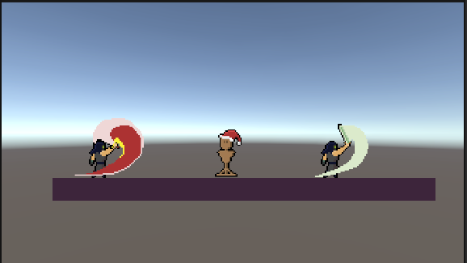

###  多枪械射击Demo

`实现2D射击游戏中不同枪械` 

具体功能细节如下

| 对象池             | 用于生成子弹,弹壳,爆炸特效,粒子特效                          |
| ------------------ | ------------------------------------------------------------ |
| **易于拓展的枪械** | **组合设计模式实现不同的枪械,新增枪械时,只需要设计不同的组件即可** |
| **特效后处理**     | **激光射线使用Bloom显示光晕**                                |

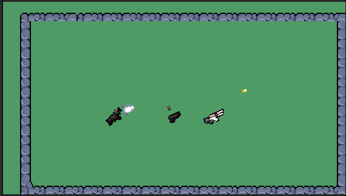

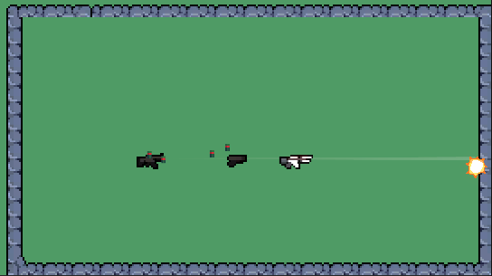

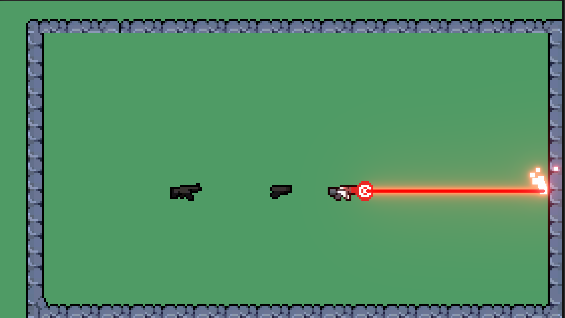

###  俯视角多人RPG

`Mirror初体验 + Youtube俯视角游戏教程`

在原本的俯视角冒险游戏基础上,使用`Mirror`将单机游戏重构为多人联机游戏,支持局域网通信.

实现了`动画`和`位置信息`的同步,整体较为简单

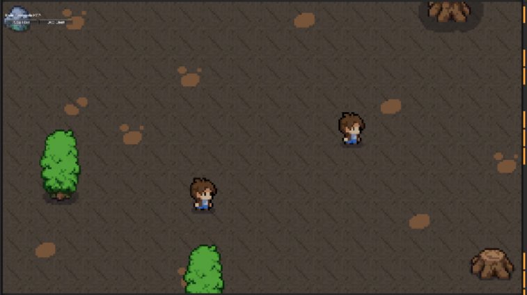

###  分手厨房

`类似分手厨房的游戏`

一个完整的游戏,包含的技术内容如下

| 场景跳转           | 主菜单,Loading,游戏场景间的切换                 |
| ------------------ | ----------------------------------------------- |
| **音效播放**       | **全局的单例音效播放器**,**场景单独的音效播放** |
| **粒子特效**       | **玩家移动脚步**,**平底锅烹饪**                 |
| **多设备输入绑定** | **修改默认输入配置,通过InputSystem实现**        |
| **JobSystem**      | **使用JobSystem完成Transform修改,利用多核cpu**  |
| **UI特效**         | **通过监听自定义的事件,来触发UI特效**           |
| **UISelect**       | **非鼠标操作UI**                                |

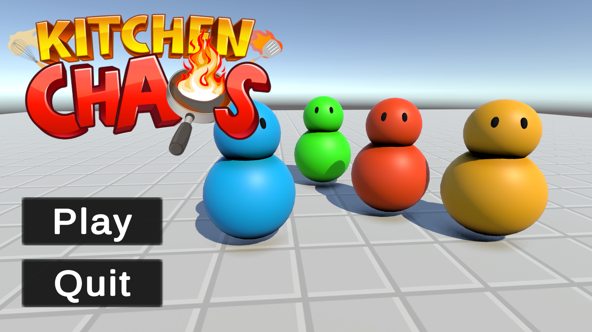

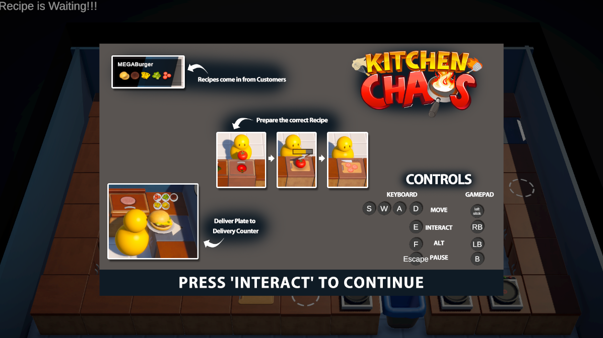

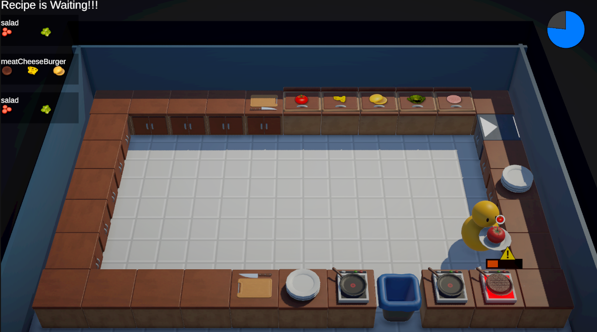

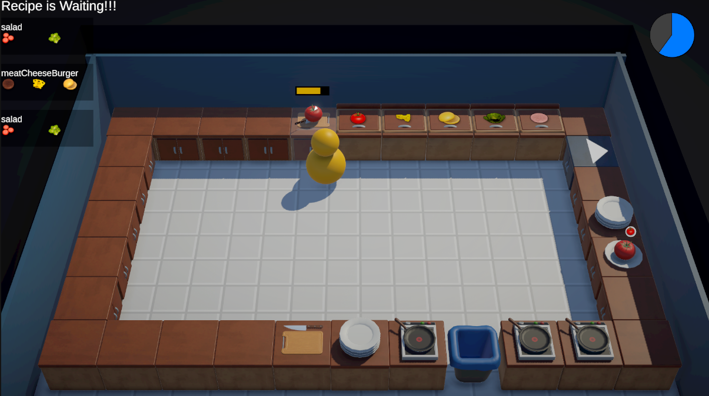

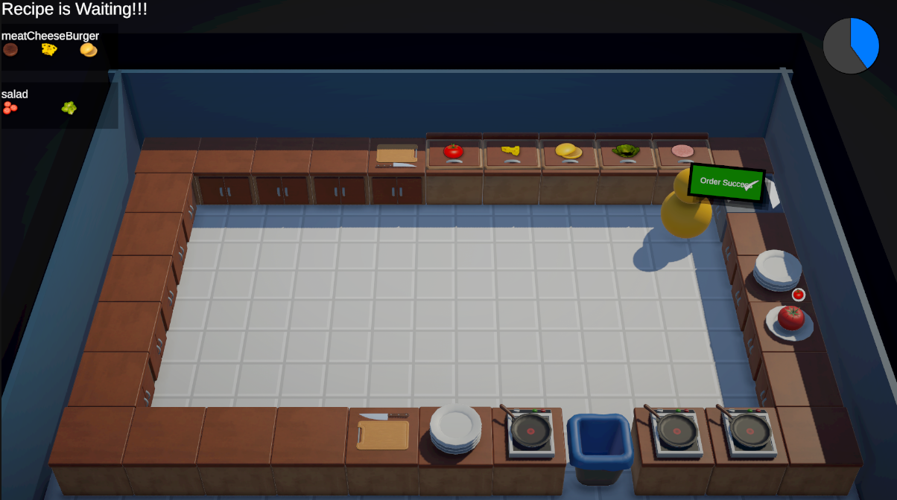

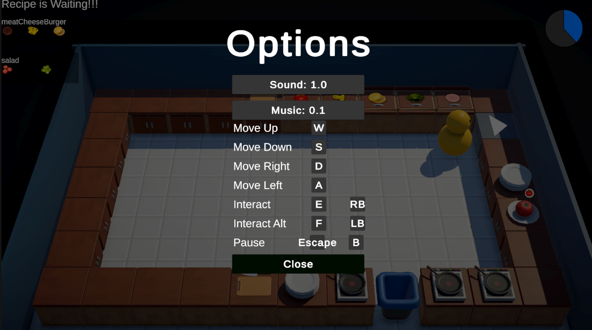

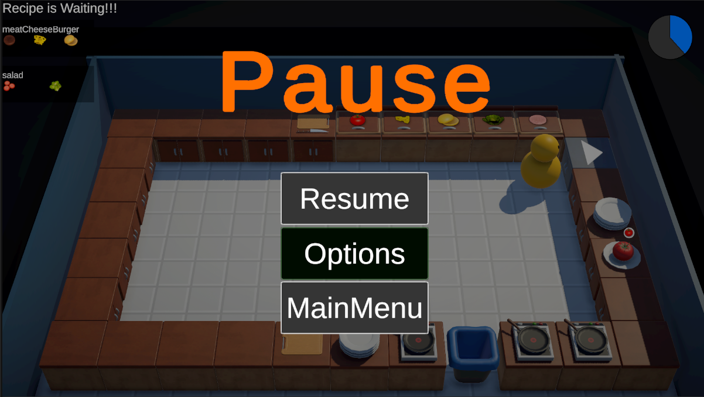

###  宝藏猎人

`开发中的2D横版闯关游戏`

发现了一套比较完整的美术资源,因此想要利用这套资源做一个完整的横版闯关游戏

技术细节

| 分层状态机             | 复杂敌人AI使用分层状态机实现 |
| ---------------------- | ---------------------------- |
| **动画Tile&&RuleTile** | **动画瓦片和规则瓦片的使用** |

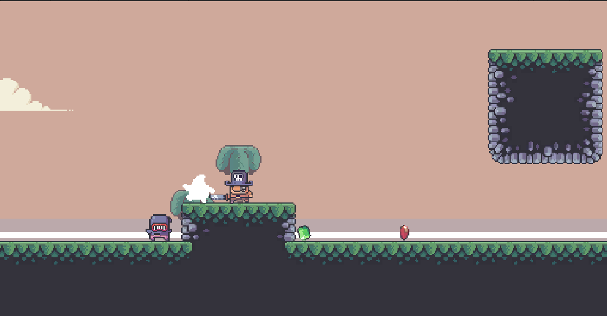
